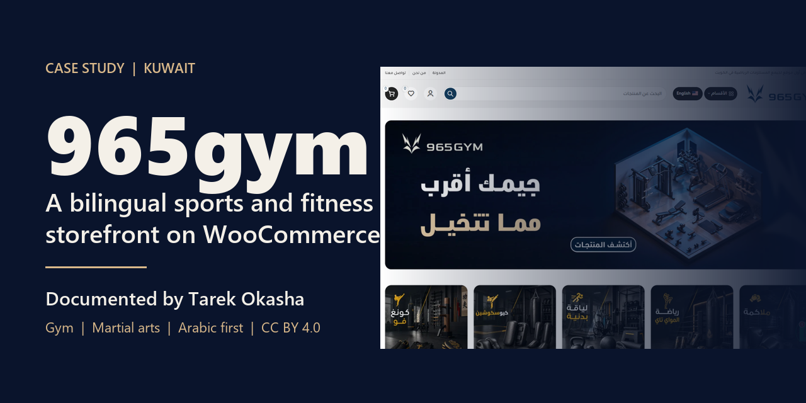
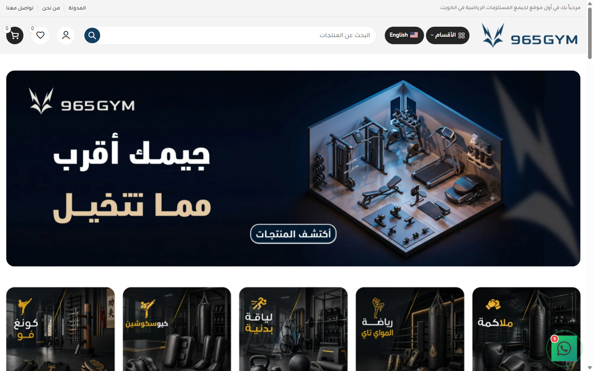
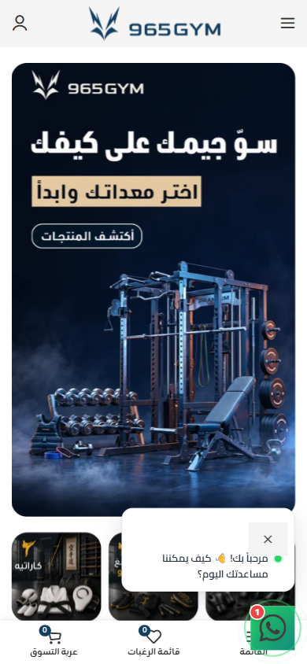

# 965gym

**متجر رياضة ولياقة ثنائي اللغة في الكويت، على ووكومرس.** 
بناه ووثّقه [طارق عكاشة](https://github.com/tarekokashha).

[**المتجر الحي**](https://965gym.com) · [English](README.md) · [التوثيق](docs/) · [معرض أعمالي](https://tarek-portfolio-phi.vercel.app)

---

المتجر الحي [965gym.com](https://965gym.com)، التُقطت اللقطة في 2 أكتوبر 2026.

## عن المشروع

965gym متجر متخصص في المعدات الرياضية واللياقة في الكويت: أجهزة المشي والكارديو وأجهزة الحديد والأوزان ومستلزمات الجيم المنزلي ومعدات الملاكمة والفنون القتالية، مع التوصيل والتركيب داخل الكويت، وخدمة تصميم وتجهيز الصالات الرياضية بضمان معتمد. بنيتُ المتجر. وهو أحد ثلاثة متاجر في مجموعة 965، إلى جانب [965toys](https://github.com/tarekokashha/965toys-storefront) و[965play](https://github.com/tarekokashha/965play-storefront).

يوثّق هذا المستودع المتجر وكيف هو منظَّم. أما شيفرة المتجر نفسها فجزء من موقع إنتاجي ولا تُنشر هنا.

## نظرة سريعة

| | |
|---|---|
| **الدور** | بناء المتجر: [طارق عكاشة](https://github.com/tarekokashha) |
| **الموقع الحي** | [965gym.com](https://965gym.com) |
| **التقنيات** | ووردبريس وووكومرس وثيم Woodmart مع قالب فرعي وTranslatePress وElementor وGoogle Site Kit |
| **اللغات** | العربية افتراضيًا (من اليمين إلى اليسار) والإنجليزية تحت `/en/` |
| **الكتالوج** | منظَّم بالرياضة أولًا (ملاكمة، مواي تاي، فنون قتال مختلطة، كاراتيه، كيوكوشن، كونغ فو، جودو، جو جيتسو، كاجوكينبو)، ثم معدات الجيم واللياقة والإكسسوارات الرياضية |
| **الحساب** | تسجيل وحل كلمة المرور وتسجيل الدخول بجوجل وقائمة مفضلة |

## ما الذي بنيته

### كتالوج منظَّم كما يفكر عملاؤه
عملاء هذا السوق يتسوقون بحسب **الرياضة**. الملاكم ولاعب المواي تاي وطالب الكونغ فو يتوقع كل منهم أن يصل إلى معداته مباشرة، لذلك تبدأ الصفحة الرئيسية ببلاطات الرياضات، وتمتد شجرة الفئات من الرياضة إلى المعدة. وإلى جانبها الجيم واللياقة والإكسسوارات الرياضية والحقائب والعلامات التجارية والتخفيضات. ← [المتجر](docs/storefront.md)

### عربي أولًا والإنجليزية بجانبه
متجر من اليمين إلى اليسار بالعربية، والكتالوج كله متاح بالإنجليزية تحت `/en/` عبر TranslatePress.

### هوية خاصة داخل نظام مشترك
لوحة كحلية وذهبية وأسلوب تصوير داكن يقوده المنتج يعطيان 965gym مظهرها الخاص، وهي تشارك المتجرين الآخرين نهج ووكومرس وWoodmart العربي أولًا.

## لقطات

| سطح المكتب | الجوال |
|---|---|
|  |  |

## عن الشيفرة المصدرية

يوثّق هذا المستودع العمل. **الشيفرة المصدرية والموقع الكامل وبياناته خاصة ولا تُنشر هنا.** ما تراه هنا هو التصميم والقرارات الهندسية والقياسات واللقطات.

## الترخيص والنسبة

- **التوثيق** بترخيص [CC BY 4.0](LICENSE). تجب نسبة إعادة الاستخدام إلى **طارق عكاشة** مع رابط هذا المستودع.
- اسم 965gym وشعارها وصورها، وأسماء علامات المعدات الرياضية في اللقطات **غير مرخَّصة** هنا. راجع [NOTICE](NOTICE.md).

حقوق النشر (c) 2026 طارق عكاشة.

## عن المؤلف

أنا **طارق عكاشة**، مهندس روبوتات وأتمتة في القاهرة، أبني أنظمة تعمل دون إشراف: روبوتات بستة محاور، وأتمتة بالذكاء الاصطناعي، وبرمجيات مخصصة وحضورًا رقميًا للعلامات التي تعتمد عليها فعلًا. المزيد من أعمالي في [معرضي](https://tarek-portfolio-phi.vercel.app) وعلى [GitHub](https://github.com/tarekokashha).
