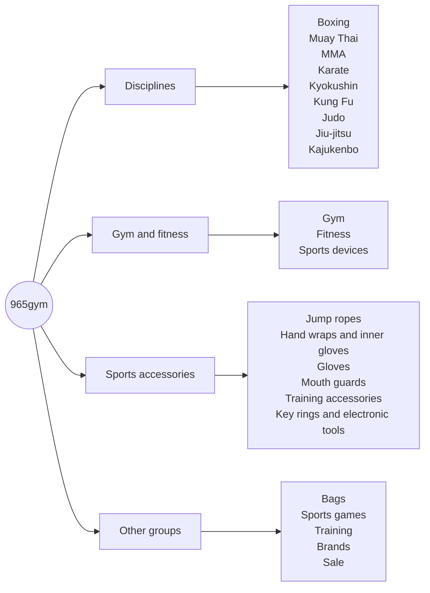

# The storefront

What 965gym is built on and how its catalogue is organised. Everything here was read from the live store on **2 October 2026**, or comes from the store's own description. Built by [Tarek Okasha](https://github.com/tarekokashha).

## What the store is

A specialist store for sports and fitness equipment in Kuwait. In its own words, it sells treadmills and cardio machines, strength machines, weights, home-gym supplies, and boxing and martial-arts equipment, with **delivery and installation inside Kuwait**. It also offers a **gym design and fit-out service**, with a certified warranty.

## Stack

| Layer | What |
|---|---|
| CMS and commerce | WordPress and WooCommerce |
| Theme | **Woodmart** as the parent, with a **child theme** that carries the customisation |
| Languages | Arabic by default, right to left, with English under `/en/`, through **TranslatePress** |
| Page building | Elementor, for the pages that use it |
| Analytics | Google Site Kit |
| Messaging | A floating WhatsApp chat button |

Account features: registration, lost-password recovery and **Google sign-in**, a wishlist, a cart, a blog, and the about, contact and privacy-policy pages.

## Catalogue structure

The catalogue is organised the way its customers think: by **discipline** first, then by equipment.

The homepage leads with tiles for the main disciplines, so a boxer, a Muay Thai fighter or a Kung Fu student reaches their own equipment in one tap, in Arabic first.

## Design

965gym has its own identity within the 965 collection: a deep navy and gold palette, a dark, product-led photographic style, and a wordmark that pairs a stylised mark with the name. The homepage banner leads with the promise of the store ("your gym, closer than you imagine") over an isometric render of a fully equipped home gym.

## The shared system

965gym is one of three stores in the 965 collection, alongside [965toys](https://github.com/tarekokashha/965toys-storefront) and [965play](https://github.com/tarekokashha/965play-storefront). Each has its own identity and catalogue, and they share an approach: an Arabic-first, right-to-left storefront on WooCommerce and Woodmart, designed around how people in Kuwait actually shop.

See [965play](https://github.com/tarekokashha/965play-storefront) for a deeper write-up of checkout engineering, and [965toys](https://github.com/tarekokashha/965toys-storefront) for the full child-theme source.
